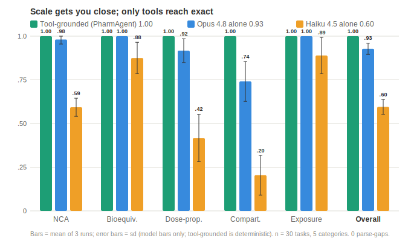

# PharmAgent

**Agentic pharmacometrics — an AI assistant that *runs* validated PK/PD analyses instead of free-handing the numbers.**

The design thesis is *agents decide, tools execute*: a language model plans the analysis, but every reported number comes from a validated, deterministic compute tool with a tamper-evident audit trail — never from tokens. This repo is the platform (FastAPI backend + React frontend) plus **PharmacometricsBench**, an eval that measures exactly that difference.

<p align="center"></p>

> **The headline result** (mean of 3 runs, 30 tasks, 5 categories): a tool-grounded agent scores **1.00** — exact by construction. A frontier model reasoning to the numbers unaided (Claude Opus 4.8) scores **0.93 ± 0.03**, near-perfect on formula-driven tasks but only **0.74** on iterative compartmental fitting; a smaller model (Haiku 4.5) scores **0.60 ± 0.04**. Scale narrows the gap; only the tools close it. Full data: [`papers/`](papers/).

---

## What's in here

| Path | What it is |
|---|---|
| [`backend/`](backend/) | FastAPI service — deterministic compute, NLME solvers, cross-engine orchestration, audit chain, SQLite persistence |
| [`backend/pharmacometricsbench/`](backend/pharmacometricsbench/) | The eval: tool-grounded ground truth, keyless MockLLM + real-model reference agents, PK-DB real-data loader |
| [`frontend/`](frontend/) | React + Vite + TypeScript UI |
| [`dashboard/`](dashboard/) | Marketing/landing dashboard (Vite + Netlify) |
| [`papers/`](papers/) | Tool-fidelity figure, caption, and pinned reproducible run logs |
| [`PHARMACOMETRICSBENCH.md`](PHARMACOMETRICSBENCH.md) · [`PROJECT_PLAN.md`](PROJECT_PLAN.md) | Design docs |

## Capabilities (backend)

- **Deterministic PK compute** — NCA (incl. steady-state), bioequivalence, dose-proportionality, compartmental fitting, exposure simulation, VPC / pcVPC, GOF diagnostics, dose sweeps.
- **True NLME** — FOCE-I and SAEM estimation, covariate modelling, stepwise covariate selection (SCM), MAP/TDM Bayesian forecasting, BLQ/M3 censored likelihood.
- **Cross-engine orchestration** — run candidate models across estimation engines and rank on *engine-agnostic prediction accuracy* (not incomparable native OFV/AIC/BIC), including a real nlmixr2 (R) adapter.
- **Provenance & governance** — SHA-256 audit hash-chain, human-in-the-loop review gate, run reproducibility reports, exports (CSV / DOCX / CDISC-ADaM / NONMEM `.ctl` / mrgsolve `.cpp`).

## PharmacometricsBench

A reproducible eval for whether an agent can *run* a pharmacometric analysis correctly. Ground truth for each task is the output a validated compute tool produces on the provided data, so the score measures reproduction, not eyeballing.

```bash
cd backend && python -m venv .venv && source .venv/bin/activate
pip install -r requirements-dev.txt

# keyless (MockLLM) reference agents — no API key needed
python -m pharmacometricsbench.runner --run oracle naive

# real model rows (needs ANTHROPIC_API_KEY); model-pinned reference agents
python -m pharmacometricsbench.runner --run oracle naive llm-opus llm-haiku
```

Real-drug FIH answer keys are harvested from [PK-DB](https://pk-db.com) with one command (writes zero fabricated tasks without a token):

```bash
python -m pharmacometricsbench.pkdb.build_fih_taskset            # anonymous → 0 tasks (auth-gated)
PKDB_API_TOKEN=... python -m pharmacometricsbench.pkdb.build_fih_taskset   # real cited tasks
```

## Quickstart

**Backend**
```bash
cd backend && python -m venv .venv && source .venv/bin/activate
pip install -r requirements.txt
uvicorn app.main:app --port 8000        # no --reload; restart after edits
```

**Frontend**
```bash
cd frontend && npm ci && npm run dev
```

The app runs fully **keyless** by default — `MockLLM` (deterministic) stands in for a real model, and the entire test suite is keyless. Set `ANTHROPIC_API_KEY` (see [`backend/.env.example`](backend/.env.example)) to use a real model.

## Tests & CI

```bash
cd backend && pytest -q            # ~300 tests
ruff check app tests               # lint
```

CI (`.github/workflows/ci.yml`) runs backend lint + tests and frontend typecheck + build on every push.

---

*Research/engineering project in clinical pharmacology & pharmacometrics. Not for clinical use.*
