# How to Run an Agentic PK Analysis: A 2026 Step-by-Step Guide

FDA's Center for Drug Evaluation and Research reports that it reviewed more than 500 submissions with AI components from 2016 to 2023 ([FDA, Artificial Intelligence for Drug Development](https://www.fda.gov/about-fda/center-drug-evaluation-and-research-cder/artificial-intelligence-drug-development), 2026). So the question for modelling groups isn't whether AI touches pharmacometric work. It's how you'll show the work was done credibly.

That's hard when a population PK analysis is still a hand-built control stream, diagnostics stitched together in R and a report assembled from screenshots. Every manual hop is a place where a number gets copied wrong, and none of it leaves a trail a reviewer can replay.

An **agentic PK analysis** is a pharmacokinetic workflow in which AI agents choose and sequence analysis tools while the arithmetic stays in deterministic, tested code and a person approves each gated step. This guide walks one through PharmAgent, end to end. We ran every step on the two datasets bundled with the app on 2026-09-29, and every screenshot comes from those runs.

<!-- [PERSONAL EXPERIENCE] -->
In our own first-user testing, an upload came back with a bare "no action taken", and the next complaint was a concentration-time plot with unlabelled axes. Both are fixed: an agent that can't act now says what it needs, and that plot carries axis titles. New to the population approach? Start with our [PK/PD modelling and simulation course](../courses/pkpd-modeling-sim/index.html).

> **Key Takeaways**
>
> - FDA's CDER reviewed more than 500 AI-containing submissions from 2016 to 2023 (FDA, 2026). Credibility of AI-assisted analysis is now a review question.
> - Every tool call lands in a SHA-256 audit chain, and the workflow stops at human gates.
> - In our run, NCA on 12 subjects reached its review gate in under a second, and a 16-subject population fit took three minutes.

## What You Need Before Your First Agentic PK Analysis

PharmAgent runs keyless with a mock language model, and its test suite collected 1,056 tests on 2026-09-29 (PharmAgent internal repository, 2026). Nothing here needs an API key, a licence or a cluster.

- PharmAgent running locally: the macOS desktop app, or the backend on port 8000 plus the frontend from `frontend/` via `npm run dev` (http://localhost:5173)
- A NONMEM-style CSV with at least `ID`, `TIME`, `DV` and `AMT` columns, plus `EVID` for dosing records. We use the bundled `theoph_pk.csv` and `cov_pk.csv`
- Optional: a local Ollama model, or a Claude or OpenAI key, for free-text questions
- **Time:** about 30 minutes. **Difficulty:** intermediate

`theoph_pk.csv` is the classic theophylline dataset distributed with R as `Theoph` ([Boeckmann, Sheiner and Beal, NONMEM Users Guide Part V](https://stat.ethz.ch/R-manual/R-devel/library/datasets/html/Theoph.html), 1994), with dose converted from mg/kg to mg. Concentrations are in mg/L and time in hours. `cov_pk.csv` is a 16-subject demonstration dataset that ships with the app, with creatinine clearance and age as covariates.

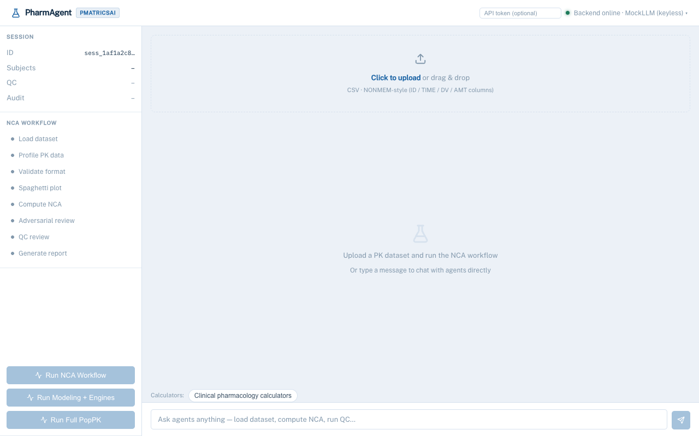

Want the architecture first? The [How it works section](../index.html#workflow) shows how a supervisor routes each request to an agent and the deterministic tools it calls. A **human review gate** is a checkpoint where the workflow pauses until a person approves or rejects the results so far.

## Step 1: Load and Profile the Dataset

**Outcome:** a loaded dataset, a profile of its records and a concentration-time plot. Everything downstream inherits the column roles decided here, so the data manager agent settles them once, in the open.

1. Click **Click to upload** or drag `theoph_pk.csv` onto the drop zone.
2. **Click Run NCA Workflow.** The sidebar ticks through Load dataset, Profile PK data, Validate format and Spaghetti plot.

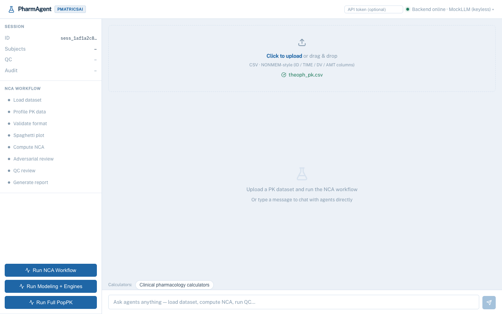

Verification: the sidebar shows **Subjects 12**, and the data manager posts "Dataset loaded: 144 records, 12 subjects, 8 columns." The plot card reports 9 below-quantification points excluded.

<!-- [UNIQUE INSIGHT] -->
One detail is easy to miss. NONMEM exports use a bare period for missing values, and most CSV readers keep it as the string ".". PharmAgent registers "." as a missing-value marker before parsing, so `AMT` on observation rows and `DV` on dose rows arrive as blanks instead of poisoning the numeric columns. We found this one in our own first-user bug reports.

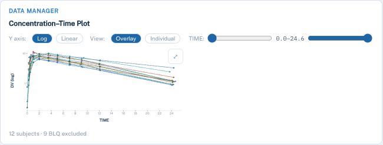

The plot gets its own step because it's where a human spots the absorption lag, the odd subject or the dosing error that no model will fix later.

## Step 2: Run NCA and Read the Summary Statistics

In this run, geometric mean apparent clearance across 12 subjects was 2.745 L/h with a geometric CV of 27.9% (PharmAgent run, 2026-09-29). NCA comes first because it's model-independent and sets the numbers a compartmental fit has to reproduce. You'll finish this step with per-subject parameters and a summary table ready for a study report.

1. Let the workflow continue. The NCA agent computes Cmax, Tmax, AUClast, AUCinf, half-life, CL/F and Vz/F per subject.
2. Scan the **Per-subject NCA** table. Orange values breach a QC rule.
3. Read the **Summary statistics** block: N, mean, SD, CV%, median, range, geometric mean and geometric CV per parameter.

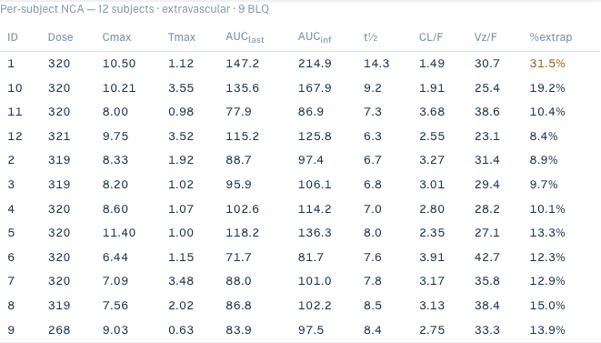

<!-- [ORIGINAL DATA] -->
Verification: subject 1 shows 31.5% of AUCinf extrapolated, flagged in orange. Mean AUCinf was 119.3 mg·h/L with a CV of 32.0%, and mean terminal half-life was 8.2 hours.

The conventions are printed under the table and again in the DOCX. SD uses n − 1, CV% = 100 × SD/mean, and geometric CV = √(exp(s²) − 1), where s² is the sample variance of the log-transformed values. A reviewer never has to guess which formula produced a number.

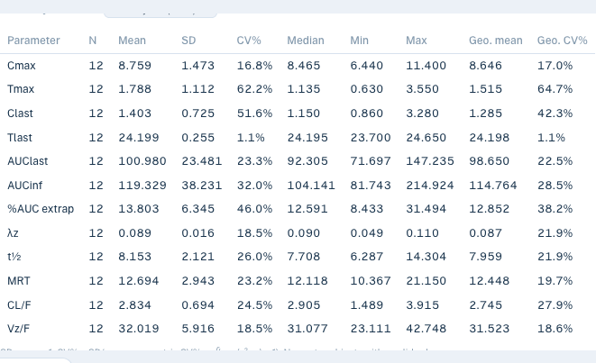

## Step 3: Check the Terminal Slope and the QC Verdict

The QC agent applies seven rules. In this run, one of 12 subjects (8%) failed the 20% AUC-extrapolation limit, and the other six rules passed (PharmAgent run, 2026-09-29). This is where an automated pipeline is tempted to cut corners, so the workflow slows down on purpose and asks you to accept or correct every terminal-slope fit.

1. Open **Terminal Slope (λz) Diagnostics**. Each subject gets a log-scale panel with the selected points and the dashed regression line.
2. Click points to include or exclude them, then press **Refit λz**. **Reset** restores the automatic choice.
3. Read the **QC Verdict** card. It lists each rule, its threshold and how many subjects fail it.

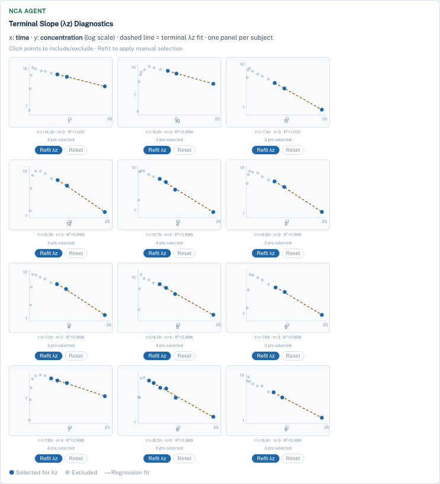

Verification: every subject used three to six points, and each panel's R² was 0.989 or better. The verdict reads **CONDITIONAL PASS** with one MEDIUM finding, "high %extrap: [1]".

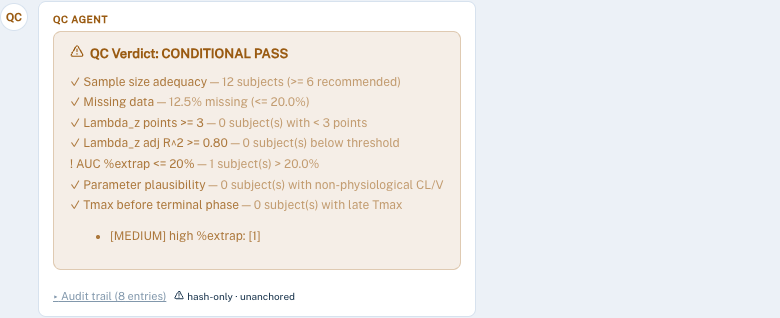

<!-- [UNIQUE INSIGHT] -->
The limits sit in the card where you can see them. The QC rules ask for at least 6 subjects, at most 20% missing data, at least 3 terminal points and an adjusted R² of 0.80 or better. They also require at most 20% extrapolated AUC, plausible CL and V, and Tmax before the terminal phase. These are constants in the QC code, so an agent can't relax them mid-run; changing one is a reviewed code change.

## Step 4: Approve the Human Gate and Export the Report

In January 2025, FDA proposed a risk-based framework for AI models. It asks sponsors to establish a model's credibility for a stated context of use ([FDA, press release on the AI credibility framework](https://www.fda.gov/news-events/press-announcements/fda-proposes-framework-advance-credibility-ai-models-used-drug-and-biological-product-submissions), 2025). The gate is one control that supports that kind of assessment, not a substitute for it: agents propose, and a person decides.

1. Read the amber **Human Review Required** banner.
2. Click **Approve** to generate the report, or **Reject** to stop the run.
3. When **Report ready** appears, click **Download DOCX**. **NCA CSV** and **CDISC ADaM (zip)** are in the export bar.

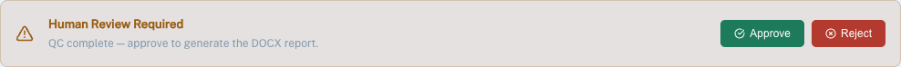

Verification: the audit counter increments, and the **Audit trail** toggle under the QC card expands to a numbered list of tool calls, each with its agent and a SHA-256 hash prefix.

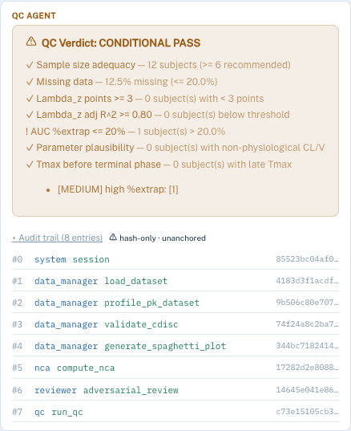

<!-- [UNIQUE INSIGHT] -->
Notice the label "hash-only · unanchored" beside the toggle. The chain is internally consistent but not yet anchored to an external timestamp. We'd rather say so than show a green badge, because a reviewer can then see exactly what the trail proves.

The stakes aren't new to regulators. Between 2000 and 2004, pharmacometric analyses were pivotal in more than half of the 42 NDAs that included one, out of about 244 surveyed ([Bhattaram et al., AAPS Journal](https://doi.org/10.1208/aapsj070351), 2005). The next two steps build that kind of model.

## Step 5: Compare Structures and Approve the Population Fit

In this run, four structural models were fitted subject by subject (two-stage) to 144 observations from 16 subjects and ranked by summed AIC within seconds. The one-compartment oral model came out ahead by 16.6 points (PharmAgent run, 2026-09-29). Settling the structure first keeps the expensive population fit from being repeated.

1. Reload for a fresh session, upload `cov_pk.csv` and click **Run Full PopPK**.
2. Read the modeler's **Model comparison** table: converged subjects, total AIC and mean AIC per model.
3. At the first gate, **click Approve**. The FOCE-I fit, stepwise covariate model, residual diagnostics, covariate forest and VPC then run as one background job.

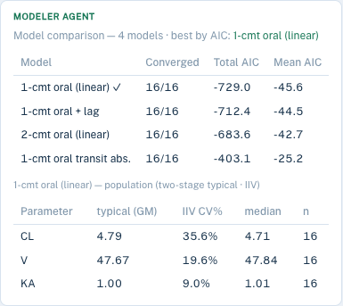

| Structural model | Converged | Total AIC | ΔAIC vs best |
|---|---|---|---|
| 1-cmt oral (linear) | 16/16 | −729.0 | 0.0 |
| 1-cmt oral + lag | 16/16 | −712.4 | 16.6 |
| 2-cmt oral (linear) | 16/16 | −683.6 | 45.4 |
| 1-cmt oral, transit absorption | 16/16 | −403.1 | 325.9 |

<figure>
<svg viewBox="0 0 560 380" style="max-width: 100%; height: auto; font-family: 'Public Sans', system-ui, sans-serif" role="img" aria-label="Lollipop chart of the AIC penalty relative to the best structural model: one-compartment oral 0, with lag 16.6, two-compartment oral 45.4, transit absorption 325.9">
  <title>AIC penalty relative to the best structural model</title>
  <desc>Delta summed AIC versus the best model, 16 subjects, two-stage fits on cov_pk.csv: 1-cmt oral 0.0; 1-cmt oral plus lag 16.6; 2-cmt oral 45.4; 1-cmt oral transit absorption 325.9. Source: PharmAgent run, 2026-09-29.</desc>
  <text x="280" y="28" text-anchor="middle" font-size="15" font-weight="700" fill="currentColor">Structural model comparison (ΔAIC vs best)</text>
  <text x="280" y="46" text-anchor="middle" font-size="11" fill="currentColor" opacity="0.45">144 observations · 16 subjects · two-stage · lower is better</text>
  <line x1="200" y1="70" x2="200" y2="300" stroke="currentColor" opacity="0.3"/>
  <line x1="200" y1="300" x2="520" y2="300" stroke="currentColor" opacity="0.3"/>
  <g font-size="10" fill="currentColor" opacity="0.5">
    <text x="200" y="316" text-anchor="middle">0</text>
    <text x="294" y="316" text-anchor="middle">100</text>
    <text x="388" y="316" text-anchor="middle">200</text>
    <text x="482" y="316" text-anchor="middle">300</text>
  </g>
  <g stroke="currentColor" opacity="0.08"><line x1="294" y1="70" x2="294" y2="300"/><line x1="388" y1="70" x2="388" y2="300"/><line x1="482" y1="70" x2="482" y2="300"/></g>
  <g font-size="12" fill="currentColor" opacity="0.8" text-anchor="end">
    <text x="190" y="104">1-cmt oral (best)</text>
    <text x="190" y="158">1-cmt oral + lag</text>
    <text x="190" y="212">2-cmt oral</text>
    <text x="190" y="266">1-cmt transit abs.</text>
  </g>
  <g stroke="currentColor" opacity="0.15" stroke-width="1">
    <line x1="200" y1="154" x2="215.6" y2="154"/>
    <line x1="200" y1="208" x2="242.7" y2="208"/>
    <line x1="200" y1="262" x2="506.3" y2="262"/>
  </g>
  <circle cx="200" cy="100" r="6" fill="#22c55e"/>
  <circle cx="215.6" cy="154" r="6" fill="#38bdf8"/>
  <circle cx="242.7" cy="208" r="6" fill="#a78bfa"/>
  <circle cx="506.3" cy="262" r="6" fill="#f97316"/>
  <g font-size="11" font-weight="700" fill="currentColor">
    <text x="212" y="104">0.0 (AIC −729.0)</text>
    <text x="228" y="158">+16.6</text>
    <text x="255" y="212">+45.4</text>
    <text x="470" y="250">+325.9</text>
  </g>
  <text x="360" y="336" text-anchor="middle" font-size="10" fill="currentColor" opacity="0.5">ΔAIC (summed over subjects)</text>
  <text x="280" y="372" text-anchor="middle" font-size="10" fill="currentColor" opacity="0.35">Source: PharmAgent run on cov_pk.csv, 2026-09-29</text>
</svg>
<figcaption>Source: PharmAgent run, 2026-09-29</figcaption>
</figure>

Verification: when the job finishes, the sidebar marks the five population steps done; ours took 180 seconds. The FOCE-I fit converged at an objective function value of −256.148. The covariate search then tested four candidates and kept creatinine clearance on CL, lowering the objective function to −271.451. That 15.3-point drop for one parameter clears the chi-square thresholds for one degree of freedom at p<0.05 (3.84) and p<0.01 (6.63). However, the tool still warns that stepwise selection makes the retained effect's standard error and p-value optimistic, and asks you to confirm on a pre-specified set or by resampling.

<!-- [ORIGINAL DATA] -->
Can you trust the estimator? We tested it against NONMEM. On a real 120-subject, 1,943-observation two-compartment reference fitted with NONMEM 7.5.0 FOCE-I with interaction, PharmAgent reproduced NONMEM's own CWRES column at a correlation of 1.000000. The same dataset exposed a bug in our SAEM combined-error model, which had pushed the additive error SD to 247 against 3.71 in NONMEM. It's fixed and covered by a regression test (PharmAgent internal validation, available on request).

## Step 6: Read the Diagnostics: Residuals, Forest and VPC

In this run, CWRES had a mean of −0.047 and an SD of 0.983 against an expected 0 and 1, and 6.9% of normalised prediction distribution values fell outside ±1.96 against an expected 5% (PharmAgent run, 2026-09-29). Those checks decide whether the fit you just approved can carry a conclusion. This step renders residual panels, a covariate forest and a prediction-corrected VPC.

1. Click **Residual diagnostics** for IWRES, CWRES and normalised prediction distribution panels against prediction, time and time after dose.
2. Click **Covariate forest** for each retained covariate's effect on clearance with a 90% confidence interval.
3. Click **VPC / goodness-of-fit**, then **⤢** on the prediction-corrected VPC to open it full screen. Scroll to zoom, drag to pan, press Escape to close.

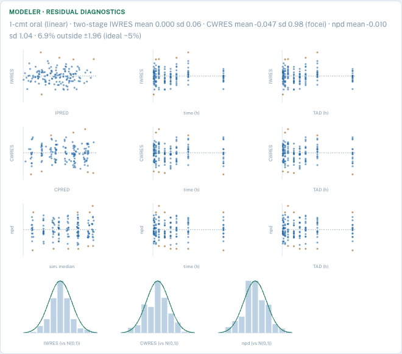

<figure>
<svg viewBox="0 0 560 380" style="max-width: 100%; height: auto; font-family: 'Public Sans', system-ui, sans-serif" role="img" aria-label="Horizontal bar chart of residual diagnostics relative to their expected values: CWRES SD 0.98, npd SD 1.04, share of npd outside plus or minus 1.96 at 1.39 times the expected 5 percent">
  <title>Residual diagnostics relative to their expected values</title>
  <desc>Ratio of observed to expected, where 1.0 is ideal: CWRES SD 0.983 over 1 gives 0.98; npd SD 1.037 over 1 gives 1.04; share of npd outside plus or minus 1.96 is 6.9 percent over 5 percent, giving 1.39. Source: PharmAgent run on cov_pk.csv, 2026-09-29.</desc>
  <text x="280" y="28" text-anchor="middle" font-size="15" font-weight="700" fill="currentColor">Residual checks vs their expected values</text>
  <text x="280" y="46" text-anchor="middle" font-size="11" fill="currentColor" opacity="0.45">observed ÷ expected · 1.0 = ideal · 144 observations</text>
  <g stroke="currentColor" opacity="0.08">
    <line x1="210" y1="70" x2="210" y2="290"/><line x1="370" y1="70" x2="370" y2="290"/><line x1="450" y1="70" x2="450" y2="290"/>
  </g>
  <line x1="130" y1="290" x2="530" y2="290" stroke="currentColor" opacity="0.3"/>
  <line x1="130" y1="70" x2="130" y2="290" stroke="currentColor" opacity="0.3"/>
  <line x1="290" y1="62" x2="290" y2="290" stroke="currentColor" opacity="0.55" stroke-dasharray="4 4"/>
  <text x="290" y="58" text-anchor="middle" font-size="10" fill="currentColor" opacity="0.6">ideal</text>
  <g font-size="10" fill="currentColor" opacity="0.5" text-anchor="middle">
    <text x="130" y="306">0</text><text x="210" y="306">0.5</text><text x="290" y="306">1.0</text><text x="370" y="306">1.5</text><text x="450" y="306">2.0</text>
  </g>
  <g font-size="12" fill="currentColor" opacity="0.8" text-anchor="end">
    <text x="122" y="112">CWRES SD</text>
    <text x="122" y="182">npd SD</text>
    <text x="122" y="244">npd outside ±1.96</text>
    <text x="122" y="258" font-size="10" opacity="0.7">(6.9% vs 5%)</text>
  </g>
  <rect x="130" y="90" width="157.3" height="34" rx="4" fill="#38bdf8"/>
  <rect x="130" y="160" width="165.9" height="34" rx="4" fill="#a78bfa"/>
  <rect x="130" y="230" width="222.2" height="34" rx="4" fill="#f97316"/>
  <g font-size="12" font-weight="800" fill="currentColor">
    <text x="296" y="112">0.98</text>
    <text x="304" y="182">1.04</text>
    <text x="360" y="252">1.39</text>
  </g>
  <text x="330" y="332" text-anchor="middle" font-size="10" fill="currentColor" opacity="0.5">ratio of observed to expected</text>
  <text x="280" y="372" text-anchor="middle" font-size="10" fill="currentColor" opacity="0.35">Source: PharmAgent run on cov_pk.csv, 2026-09-29</text>
</svg>
<figcaption>Source: PharmAgent run, 2026-09-29</figcaption>
</figure>

Verification: the residual card reports the CWRES and npd summaries above, and goodness of fit gave a log-scale R² of 0.993 across 144 observations. The tail of the npd distribution is the one to watch: 6.9% outside ±1.96 is a little heavy, worth a look but not alarming with 144 observations.

<!-- [ORIGINAL DATA] -->
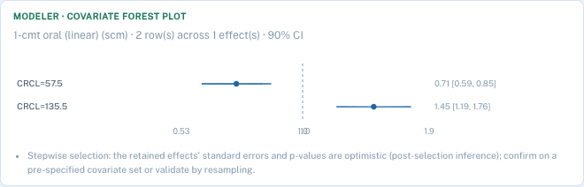

In this run, clearance was 0.71 of typical (90% CI 0.59 to 0.85) at a creatinine clearance of 57.5 and 1.45 (1.19 to 1.76) at 135.5. With real data, a dosing recommendation would hang on numbers like these, which is why the post-selection warning is repeated under the plot.

### Read the prediction-corrected VPC

A **prediction-corrected VPC** is a visual predictive check in which each observation and simulation is normalised by its typical prediction, so different doses and covariates can share one plot. Pooling dose groups on a raw VPC hides misfit, for instance a dose-dependent bias in absorption. The card says so and offers stratification by dose, creatinine clearance or age, plus dose normalisation, time after dose and a below-quantification VPC.

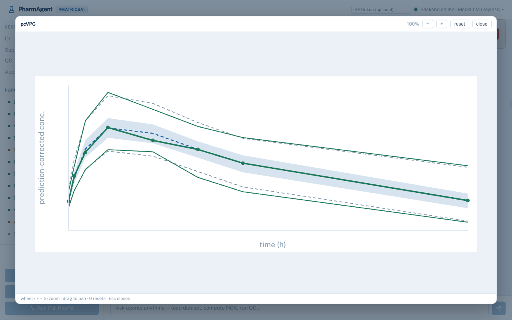

When you're satisfied, approve the final gate. In our run the adversarial reviewer met its goal of zero unresolved CRITICAL or HIGH findings, and the report was written with 18 audit entries behind it.

<!-- [PERSONAL EXPERIENCE] -->
Writing this guide surfaced some rough edges, and we'd rather list them than hide them. The first population gate still shows the NCA wording, "QC complete". Results from the background job light up the sidebar but only appear in the conversation after you click the three buttons above. Both fixes are in progress. Two cosmetic ones remain: the NCA table sorts subject IDs as text (1, 10, 11, 12, 2), and the forest plot draws two overlapping "1.0" tick labels.

For the compliance side of these exports, including the CDISC bundle and the NONMEM and mrgsolve code files, see the [Compliance section](../index.html#compliance).

## Common Mistakes to Avoid

In our run, 1 of 12 subjects (8%) breached the 20% AUC-extrapolation rule (PharmAgent run, 2026-09-29). It's an easy flag to wave through when the R² looks fine. Here are five mistakes we found while building and testing the workflow.

**1. Accepting the automatic terminal slope.** A three-point fit with an R² of 0.999 can still start before the terminal phase. Check that the first selected point sits well after Tmax, and refit where it doesn't.

**2. Pooling dose groups in the VPC.** Different doses in one time bin blur the percentiles. Stratify or dose-normalise, and read the prediction-corrected version by default.

**3. Quoting stepwise p-values as if pre-specified.** Selection makes them too small and biases retained effects away from the null. Report the effect with its interval, and confirm by bootstrap or on a pre-specified set.

**4. Treating the gate as a click-through.** The audit trail records your decision. Read the QC card first; rejecting now is cheaper than defending an approval later.

<!-- [PERSONAL EXPERIENCE] -->
**5. Letting an agent loop.** Our testing caught an agent re-issuing an identical tool call with identical arguments in one turn. The loop now stops on a repeat, and expensive runs such as bootstrap, sampling-importance-resampling, likelihood profiling and simulation-estimation only start as proposals a person confirms.

## What Success Looks Like

If everything went correctly, you have two DOCX reports and an audit chain of 18 entries behind the population one (PharmAgent run, 2026-09-29). Every sidebar step is green, and the export bar offers model, NLME and VPC CSVs plus NONMEM and mrgsolve code files.

- The NCA report has per-subject parameters, summary statistics with their formulas, dose-group summaries and the QC checks
- The population report adds sections for the structural model, the FOCE-I fit, covariate selection, residual diagnostics, covariate effects and GOF/VPC evaluation
- Every tool call appears in the audit trail with its agent and hash

<!-- [UNIQUE INSIGHT] -->
One limit to know: the DOCX carries tables and text, not figures. Take plots from the app, or rebuild them from the NLME and VPC CSV exports.

Stretch goal: click **Run Modeling + Engines** on the same data. It fits PharmAgent's own estimator and, where installed and licensed, nlmixr2 or Monolix. It then ranks engines on prediction error, since objective function values aren't comparable across engines. See the [Architecture section](../index.html#architecture).

## Frequently Asked Questions

### How long does an agentic PK analysis take?

In our run, NCA on 12 subjects reached its review gate in under a second. The population workflow on 16 subjects compared four structures in seconds. It then ran the FOCE-I fit, four covariate candidates, diagnostics and a 200-simulation VPC as a background job in 180 seconds (PharmAgent run, 2026-09-29). Bigger datasets and richer models take longer.

### Can I use NONMEM or nlmixr2 instead of the built-in estimator?

Yes. The export bar writes a NONMEM control stream and an mrgsolve model file, and the cross-engine workflow runs nlmixr2 or Monolix alongside the native fit where installed. Against a 120-subject NONMEM 7.5.0 reference, the native estimator reproduced NONMEM's CWRES at a correlation of 1.000000 (PharmAgent internal validation, 2026).

### What should I do if the QC verdict fails?

Read which of the seven rules failed. Fewer than 6 subjects or more than 20% missing data are dataset problems, not fitting problems. Terminal-slope failures get fixed by refitting λz. A plausibility failure on CL or V usually means a unit or dose-column error, so check column roles before touching the model.

### Do I need an API key?

No. The keyless mock model runs all three fixed workflows offline, and the 1,056-test suite runs without a key too. For free-text questions, point the app at a local Ollama model or add a Claude or OpenAI key from the model switcher in the header. Keys stay in memory and are never written to disk.

### Will a regulator accept output from an AI-assisted workflow?

Not automatically. FDA's January 2025 draft guidance judges an AI model's credibility for its stated context of use, and ICH M15 on model-informed drug development became final in June 2026 ([FDA, M15 General Principles for Model-Informed Drug Development](https://www.fda.gov/regulatory-information/search-fda-guidance-documents/m15-general-principles-model-informed-drug-development), 2026). Audit trails and human gates support a credibility assessment under the FDA framework. They don't replace your own validation.

## Conclusion

An agentic PK analysis doesn't replace your judgement, and a population PK analysis doesn't have to be a week of hand-offs. In one sitting you've taken a raw concentration-time file through NCA, QC, a gated structural comparison, a FOCE-I fit with covariate selection, the diagnostic set and two reports.

- Agents propose, deterministic tools compute, and a person approves each gate
- QC limits are visible on the card and fixed in code
- The audit chain, exports and code files are the evidence a reviewer will ask for, and the DOCX still needs your figures

In 2024, a multisector group of pharmacometricians wrote that demand for modellers outmatches the supply from academic programmes ([Bonate et al., Journal of Pharmacokinetics and Pharmacodynamics](https://doi.org/10.1007/s10928-023-09878-4), 2024). Tools that make one careful modeller faster are part of closing that gap. [Request a walkthrough](../index.html#contact) to try it on your own data, or take the [handling missing data course](../courses/handling-missing-data-r/index.html) to prepare a dataset that passes QC first time.

## Watch: Population PK Fundamentals

Two NIH Clinical Center lectures from the Principles of Clinical Pharmacology series cover the concepts this guide automates.

- [Population Pharmacokinetics with Dr. Robert R. Bies](https://www.youtube.com/watch?v=TozOUOj2YvI) (NIH Clinical Center, YouTube)
- [Pharmacodynamic and Pharmacokinetic Modeling of Data with Dr. Joga Gobburu](https://www.youtube.com/watch?v=cJXC3kc91jM) (NIH Clinical Center, YouTube)

## Sources

- FDA, Artificial Intelligence for Drug Development, retrieved 2026-09-29, <https://www.fda.gov/about-fda/center-drug-evaluation-and-research-cder/artificial-intelligence-drug-development>
- FDA, FDA Proposes Framework to Advance Credibility of AI Models Used for Drug and Biological Product Submissions (press release, 6 January 2025), retrieved 2026-09-29, <https://www.fda.gov/news-events/press-announcements/fda-proposes-framework-advance-credibility-ai-models-used-drug-and-biological-product-submissions>
- FDA, M15 General Principles for Model-Informed Drug Development (final guidance, June 2026), retrieved 2026-09-29, <https://www.fda.gov/regulatory-information/search-fda-guidance-documents/m15-general-principles-model-informed-drug-development>
- Bhattaram VA et al., Impact of pharmacometrics on drug approval and labeling decisions: a survey of 42 new drug applications, AAPS Journal 7(3):E503-12, 2005, retrieved 2026-09-29, <https://doi.org/10.1208/aapsj070351>
- Bonate PL et al., Training the next generation of pharmacometric modelers: a multisector perspective, Journal of Pharmacokinetics and Pharmacodynamics 2024, retrieved 2026-09-29, <https://doi.org/10.1007/s10928-023-09878-4>
- Boeckmann AJ, Sheiner LB, Beal SL, NONMEM Users Guide: Part V (1994), as documented for R's Theoph dataset, retrieved 2026-09-29, <https://stat.ethz.ch/R-manual/R-devel/library/datasets/html/Theoph.html>
- PharmAgent runs on the bundled datasets theoph_pk.csv and cov_pk.csv, 2026-09-29. Test count and the NONMEM 7.5.0 CWRES and SAEM findings come from PharmAgent's internal repository and validation notes, available on request.
